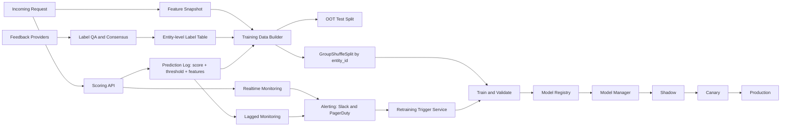
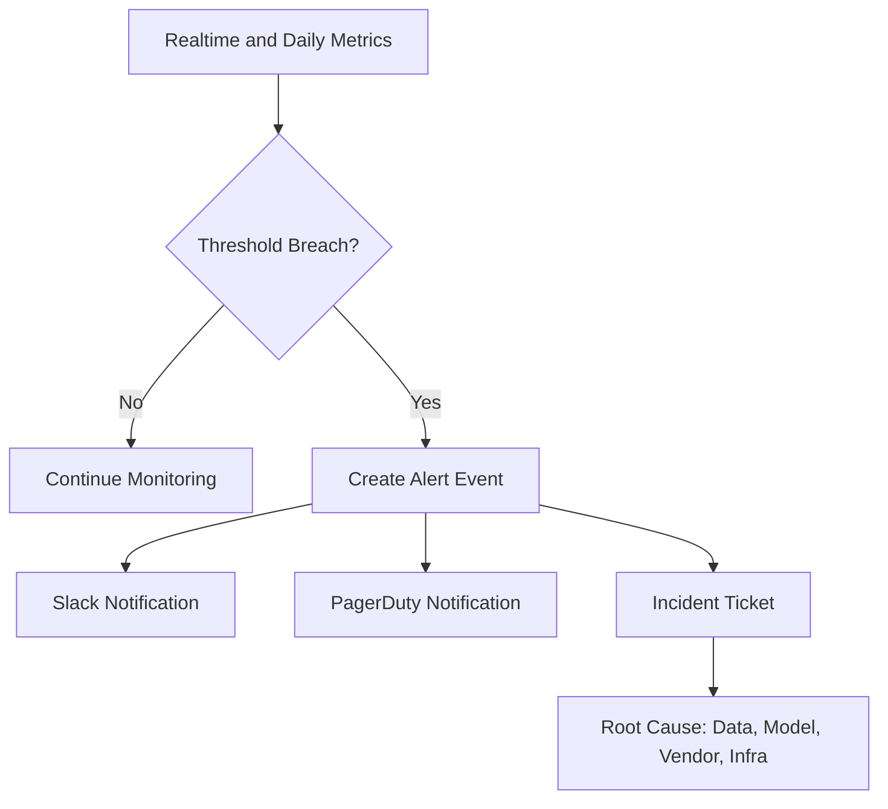
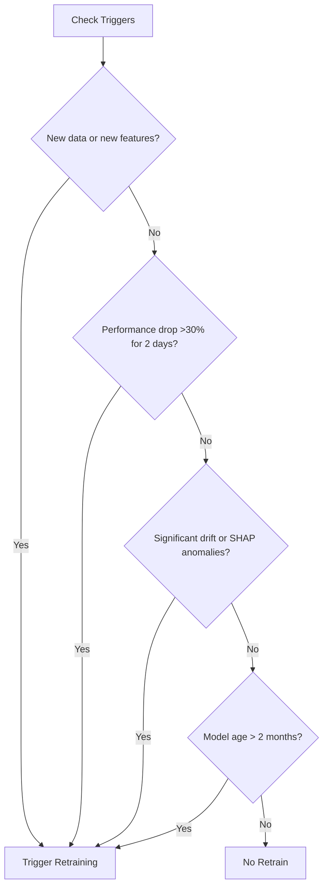
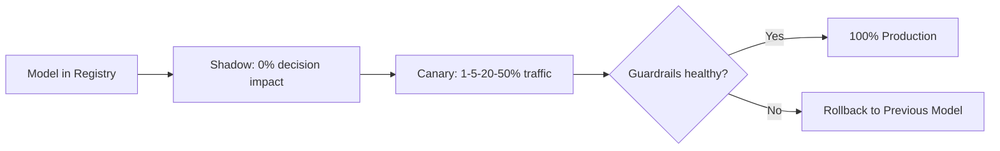

# Closed-Loop Model Retraining Design

## 1. Executive Summary
This design upgrades a manually operated binary classification system into a maintainable, auditable, closed-loop ML platform. The system keeps entity-level label quality at the center, monitors online behavior in realtime and lagged feedback, and triggers retraining based on measurable conditions instead of ad hoc runs.

Primary outcomes:
1. Higher recall at high precision without sacrificing control.
2. Faster and safer model updates with clear rollback.
3. Better maintainability for teams beyond the original author.

## 2. Decision Principles
1. Labels are first-class assets: poor labels cap model quality.
2. Entity-level consistency is mandatory for training correctness.
3. Delayed feedback requires strong realtime proxy monitoring.
4. Retraining is expensive, so trigger it only on justified signals.
5. Delivery and monitoring must be managed by CI/CD with full audit trail.

## 3. Data Contracts

### 3.1 Label and Feedback Schema

```text
request_ts,
request_id,
entity_id,
label (unclear, correct, incorrect),
label_provider_id
```

Rules:
1. Use stable entity-level identity. The same entity across many request_id values must map to one entity_id.
2. Accept multiple label sources per entity context.
3. Track label provenance using label_provider_id for QA/QC and governance.

### 3.2 Model Feature Schema

```text
request_ts,
request_id,
entity_id,
num_feat_1,
num_feat_2,
cat_feat_1,
cat_feat_2,
graph_embedding_1,
graph_embedding_2
```

Feature versioning policy:
1. Never mutate a feature used by active production models.
2. If logic changes, create a new versioned feature, for example num_feat_1_v2.
3. Keep old versions serving until all dependent models are retired.

## 4. End-to-End Architecture



## 5. Label QA/QC at Entity Level

### 5.1 Aggregation and Alignment
For each entity_id context:
1. Aggregate labels from all providers.
2. Compute max_voted_label.
3. Compute alignment_score.

### 5.2 Usage Policy in Training
1. If alignment_score >= 0.8, keep with full weight.
2. If alignment_score < 0.8, drop or include with reduced sample weight.
3. Exclude unclear labels from core supervised training unless explicitly modeled.

```python
from collections import Counter

def resolve_entity_label(labels, alignment_threshold=0.8, low_weight=0.3):
    counts = Counter(labels)
    label, votes = counts.most_common(1)[0]
    alignment_score = votes / len(labels)

    if alignment_score >= alignment_threshold:
        return label, 1.0, alignment_score, "keep"
    return label, low_weight, alignment_score, "downweight_or_drop"
```

## 6. Training Dataset and Split Strategy

### 6.1 Build Training Dataset
Join label_table and model_features on request keys while preserving entity identity.

```sql
SELECT
  f.request_ts,
  f.request_id,
  f.entity_id,
  f.num_feat_1,
  f.num_feat_2,
  f.cat_feat_1,
  f.cat_feat_2,
  f.graph_embedding_1,
  f.graph_embedding_2,
  l.label,
  l.label_provider_id
FROM model_features f
JOIN label_table l
  ON f.request_id = l.request_id
WHERE l.label IN ('correct', 'incorrect', 'unclear');
```

### 6.2 Split Strategy
1. Reserve the newest slice as out-of-time test.
2. Split the remainder into train and validation using GroupShuffleSplit by entity_id.
3. Guarantee no entity_id leakage across train and validation.

```python
from sklearn.model_selection import GroupShuffleSplit

df = df.sort_values("request_ts")
cutoff = int(len(df) * 0.8)

oot_test = df.iloc[cutoff:].copy()
train_val = df.iloc[:cutoff].copy()

splitter = GroupShuffleSplit(n_splits=1, test_size=0.2, random_state=42)
train_idx, val_idx = next(splitter.split(train_val, groups=train_val["entity_id"]))

train_df = train_val.iloc[train_idx].copy()
val_df = train_val.iloc[val_idx].copy()
```

## 7. Monitoring Framework

All monitors, thresholds, and dashboards are managed as code in GitHub with CI/CD deployment to Datadog or Grafana.

### 7.1 Online Realtime Monitoring

Flag rate alerts:
1. High priority:
   - rolling_avg_1min / rolling_avg_1day > 1.8
   - rolling_avg_1min / rolling_avg_1day < 0.2
   - flag_rate == 0
2. Medium priority:
   - rolling_avg_1min / rolling_avg_1day > 1.5
   - rolling_avg_1min / rolling_avg_1day < 0.5
3. Low priority:
   - rolling_avg_24hr / rolling_avg_72hr > 1.3
   - rolling_avg_24hr / rolling_avg_72hr < 0.7

Raw score shift alert:
1. High priority when median_model_score_1d / median_model_score_7d < 0.5 or > 1.5.

### 7.2 Feature Drift Monitoring
1. Univariate checks with t-test on hourly or daily numerical means.
2. Multivariate checks using second-order and third-order feature interaction metrics.
3. Alert if p_value < 0.05.

### 7.3 SHAP Monitoring
1. Compute daily sampled SHAP values for top 50 features.
2. Alert when avg_shap_value_last_1d / avg_shap_value_last_7d > 1.8 or < 0.3.



## 8. Lagged Performance Monitoring

As labels arrive after days or weeks, track:
1. Precision of flags.
2. Recall of flags.
3. Recall at expected precision.
4. Calibration ECE.

Alert policy:
1. If any metric drops by more than 50 percent versus prior four-week baseline, raise degradation alert.

## 9. Retraining Trigger Policy

Retraining trigger sources:
1. Manual execution.
2. One-click UI action, for example Streamlit.
3. Event-driven trigger via Kafka or queue.

Automated trigger conditions:
1. New data or features available.
2. Recall at expected precision drops >30 percent for 2 consecutive days.
3. Significant SHAP or feature drift anomalies.
4. Model age exceeds two months.



## 10. Model Lifecycle and Promotion

### 10.1 Multi-model Execution
1. Multiple active models can score the same record.
2. If any approved model flags, send a flag.
3. Retire weak models through a model_manager policy.

### 10.2 Promotion Gate
Promotion criteria:
1. Candidate model beats production on target metric, preferably recall at expected precision.
2. Candidate passes staging and shadow tests.
3. No dead-letter queue or serving pipeline failures.
4. Unit tests pass for edge cases such as missing values.

Promotion mechanism:
1. Merge approved PR to CI/CD pipeline.
2. Update production model configuration from versioned artifact.
3. Keep rollback ready by reverting PR/config quickly.
4. Avoid releases before weekends and holidays.

### 10.3 Deployment Strategy Choice
Accepted approach:
1. Canary deployment, because model errors are high-impact and feedback is delayed.
2. Rollout path: Shadow -> Canary -> Full.

Rejected for now:
1. Blue-green deployment due to current operational maturity and missing dedicated traffic-routing service.



## 11. Disagreement Handling

### 11.1 Model-vs-Model Disagreement
Possible causes:
1. New trend.
2. Data anomaly.
3. True edge case.

Actions:
1. Route disagreements to review queue.
2. Measure precision on disagreement slice.
3. Correlate with anomaly monitors.
4. Improve labels QA/QC if disagreement maps to noisy labels.

### 11.2 Signal-vs-Model Disagreement
1. Check recent signal code changes.
2. Confirm external vendor behavior changes.
3. Validate label alignment score.
4. Add targeted heuristic override rule for known high-risk combinations.

## 12. Prediction Log and Offline Controls

Maintain a continuously growing prediction log containing:
1. Raw model score.
2. Threshold used.
3. Final decision.
4. Input feature snapshot.
5. Model version metadata.

Use this log to build offline recall recovery controls, including detection of entities missed by realtime paths.

## 13. Constraints and Design Responses

### 13.1 Delayed and Incomplete Feedback
Response:
1. Estimate recent performance with lagged labels.
2. Use realtime proxy metrics and threshold controls.
3. Add manual review channels for faster explicit labels.

### 13.2 Expensive Retraining
Response:
1. Retrain only when trigger conditions are met.
2. Use sample weighting to emphasize recent and high-purity labels.

### 13.3 Costly Downstream Reversal
Response:
1. Regularly re-optimize decision thresholds using arriving feedback.
2. Prefer conservative rollout and strong rollback guardrails.

### 13.4 Maintainability Requirement
Response:
1. Publish design manuals and troubleshooting docs.
2. Use model governance and clear ownership.
3. Favor stateless service design.
4. Apply SOLID coding principles.
5. Provision infrastructure using Terraform for auditable changes.

## 14. Explicit Non-choices and Assumptions

Accepted:
1. Canary rollout for safer behavior validation.
2. Class imbalance handling using class weights.
3. Label-noise handling with consensus, alignment, and sample weights.
4. Drift-first operations because realtime true labels are delayed.
5. GitHub CI/CD as default control plane for monitors and model config.

Not chosen now:
1. Blue-green as primary model rollout strategy.
2. Training on unclear labels in core binary objective.

## 15. Operational Checklist

Before promoting a model:
1. Data contract validation passed.
2. Label QA/QC metrics within acceptable range.
3. OOT and validation metrics passed.
4. Shadow and canary guardrails healthy.
5. Alert routes verified in Slack and PagerDuty.
6. Rollback path tested.
7. Governance metadata and release notes published.


