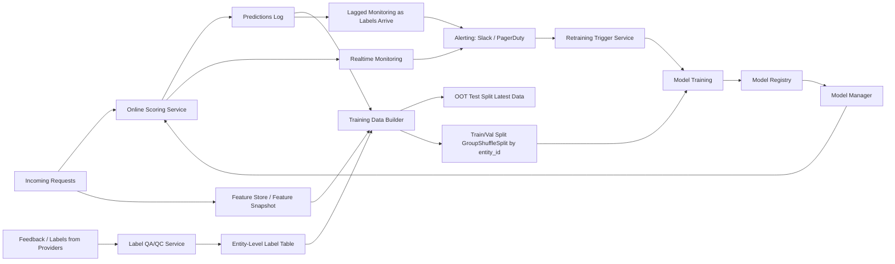

# Closed-Loop Model Retraining Design

## 1. Purpose
This design defines a practical closed-loop ML system where:
- labels are managed at entity level,
- labels from multiple providers are quality-checked,
- model/data behavior is monitored in realtime and with lagged feedback,
- retraining is triggered by data, drift, and performance conditions,
- multiple models can run in parallel and be managed over time.

The objective is to maximize correct flags and maintain high recall at high precision, while staying resilient to delayed labels and vendor/data changes.

---

## 2. Data Contracts

### 2.1 Label / Feedback Schema

```text
request_ts,
request_id,
entity_id,
label (unclear, correct, incorrect),
label_provider_id
```

Design notes:
- `entity_id` is the canonical grouping key. If one entity appears across multiple `request_id` values (for example, same candidate across multiple jobs), all events must retain the same `entity_id`.
- Multiple `label_provider_id` values can label the same entity/request context.

### 2.2 Model Feature Schema

```text
request_ts,
request_id,
entity_id,
num_feat_1,
num_feat_2,
cat_feat_1,
cat_feat_2,
graph_embedding_1,
graph_embedding_2
```

Versioning rule:
- If any existing feature definition changes, create a new versioned feature name (example: `num_feat_1_v2`).
- Do not overwrite legacy feature columns used by active production models.

---

## 3. Entity-Level Label QA/QC

Entity-level labels enable consistency checks before model training.

### 3.1 Aggregation Strategy
For each `entity_id` (or `entity_id` + task context where applicable):
- collect labels from all providers,
- compute consensus label (for example `max_voted_label`),
- compute `alignment_score` across providers.

### 3.2 Training Weight Policy
- If `alignment_score >= 0.8`: keep label at full sample weight.
- If `alignment_score < 0.8`: either
  - drop the sample, or
  - keep it with reduced sample weight.

This directly enforces the principle: model quality is bounded by label quality.

Example pseudocode:

```python
from collections import Counter

def resolve_entity_label(labels, alignment_threshold=0.8, low_weight=0.3):
    """
    labels: list[str] from multiple providers for one entity context
    returns: (resolved_label, sample_weight, alignment_score, action)
    """
    counts = Counter(labels)
    resolved_label, votes = counts.most_common(1)[0]
    alignment_score = votes / len(labels)

    if alignment_score >= alignment_threshold:
        return resolved_label, 1.0, alignment_score, "keep"

    # Policy switch: either drop or keep with lower weight
    return resolved_label, low_weight, alignment_score, "downweight"
```

---

## 4. End-to-End Architecture



---

## 5. Training Data Build and Splits

### 5.1 Training Data Build
Training data is built by joining label table with model feature table on request-level keys while preserving `entity_id`.

```sql
SELECT
  f.request_ts,
  f.request_id,
  f.entity_id,
  f.num_feat_1,
  f.num_feat_2,
  f.cat_feat_1,
  f.cat_feat_2,
  f.graph_embedding_1,
  f.graph_embedding_2,
  l.label,
  l.label_provider_id
FROM model_features f
JOIN label_table l
  ON f.request_id = l.request_id
WHERE l.label IN ('correct', 'incorrect', 'unclear');
```

### 5.2 Split Strategy
1. Create an out-of-time test set from latest data.
2. For remaining older data, split train/val using random `GroupShuffleSplit` by `entity_id`.
3. Ensure same `entity_id` cannot appear in both train and val.

```python
import pandas as pd
from sklearn.model_selection import GroupShuffleSplit

# df has columns: request_ts, entity_id, label, feature columns...
df = df.sort_values("request_ts")

# Example OOT split: latest 20% by time as test
cutoff_idx = int(len(df) * 0.8)
oot_test = df.iloc[cutoff_idx:].copy()
train_val = df.iloc[:cutoff_idx].copy()

# Group split for train/val
splitter = GroupShuffleSplit(n_splits=1, test_size=0.2, random_state=42)
train_idx, val_idx = next(
    splitter.split(train_val, groups=train_val["entity_id"])
)

train_df = train_val.iloc[train_idx].copy()
val_df = train_val.iloc[val_idx].copy()
```

---

## 6. Monitoring and Alerting

Monitoring should be implemented in Datadog (or Grafana equivalent) with:
- metric/chart definitions in a GitHub repository,
- CI/CD for threshold and monitor updates,
- Slack/PagerDuty integrations for alerts.

### 6.1 Online / Realtime Model Monitoring

#### A. Flag Rate Monitoring (using `predict_proba` decisioning)

High priority:
- if `rolling_avg_1min / rolling_avg_1day > 1.8` -> alert: too high flag_rate
- if `rolling_avg_1min / rolling_avg_1day < 0.2` -> alert: too low flag_rate
- if `flag_rate == 0` -> high-priority alert: no ML flags raised

Medium priority:
- if `rolling_avg_1min / rolling_avg_1day > 1.5` -> alert: flag rate 50% higher
- if `rolling_avg_1min / rolling_avg_1day < 0.5` -> alert: flag rate 50% lower

Low priority:
- if `rolling_avg_24hr / rolling_avg_72hr > 1.3` -> alert: flag rates trending higher in last 1 day
- if `rolling_avg_24hr / rolling_avg_72hr < 0.7` -> alert: flag rates trending lower in last 1 day

#### B. Raw Model Score Monitoring
Flag-rate alone can hide sub-threshold score drift.

High priority:
- if `median_model_score_1d / median_model_score_7d < 0.5` or `> 1.5` -> alert: median model scores shifted; check input distributions

### 6.2 Input Feature Drift Monitoring

Options:
- custom in-house checks,
- vendor tools (for example WhyLabs / Anomalo).

Univariate:
- numerical features: run t-test on hourly/daily means,
- if `p_value < 0.05` -> alert: feature may be drifting/spiking.

Multivariate:
- create 2nd-order and 3rd-order feature group metrics,
- run t-test on those grouped metrics,
- if `p_value < 0.05` -> alert: feature interaction may be drifting/spiking.

### 6.3 SHAP Monitoring
Daily sampled SHAP computation for top 50 features.

- if `avg_shap_value_last_1d / avg_shap_value_last_7d > 1.8` or `< 0.3` -> alert: feature impact to model has potentially changed.

---

## 7. Lagged (Labeled) Performance Monitoring

Because feedback arrives after 1-2 weeks, track metrics as labels arrive:
- precision of flags,
- recall of flags,
- recall@expected_precision,
- calibration ECE (expected calibration error).

Alert condition:
- if any metric drops by more than 50% versus prior 4-week level -> alert: model performance degraded; evaluate retraining.

---

## 8. Retraining Triggers

Retraining can be triggered manually, via UI button (for example Streamlit), or by Kafka/service-queue event.

```mermaid
flowchart TD
    A[Trigger Check] --> B{New data/features available?}
    B -->|Yes| R[Start Retraining]
    B -->|No| C{Performance drop?}
    C -->|Recall@ExpectedPrecision drop >30% for 2 days| R
    C -->|No| D{Anomaly / Drift present?}
    D -->|Significant SHAP or t-test spike| R
    D -->|No| E{Cadence reached?}
    E -->|latest_model_trained_since > 2 months| R
    E -->|No| F[No retrain]
```

Trigger categories:
1. New data/features available
   - new vendor data ingested and featurized,
   - existing features updated and version incremented,
   - new user cohort/market available.
2. Model performance drop
   - recall@expected_precision drop larger than 30% for 2 consecutive days.
3. Significant anomaly/drift
   - SHAP spikes or feature t-test spikes.
4. Retraining cadence reached
   - latest model age exceeds 2 months.

---

## 9. Multiple Models Framework

Design principle:
- prioritize correct flags and high recall at high precision, whether from one model or several.

Execution:
- run multiple models in parallel on the same input features,
- if any eligible model flags a case, flag the case,
- use a `model_manager` policy to onboard, evaluate, and retire models over time.

Example serving pseudocode:

```python
def ensemble_flag(models, feature_row, threshold_map):
    """Return flagged=True if any active model flags."""
    decisions = []
    for model_name, model in models.items():
        score = model.predict_proba(feature_row)[0, 1]
        decisions.append(score >= threshold_map[model_name])
    return any(decisions)
```

---

## 10. Disagreement Handling

### 10.1 Models Disagreement
When two models disagree on a case, treat as one of:
- shifting trend,
- anomaly,
- edge case.

Actions:
- shifting trend: send to review queue; calculate precision on disagreed cases,
- anomaly: verify whether anomaly monitors also fired and align interpretation,
- edge case: improve label QA/QC and labeling quality.

### 10.2 Signals Disagreement
If upstream signals conflict with model behavior:
- check latest signals code changes,
- confirm with vendors whether they changed data behavior,
- if signals are fine, inspect label alignment score.

Remedy:
- create a heuristic override rule running in parallel to ML decisions for specific signal combinations.

---

## 11. Operational Guardrails

- Keep all monitor definitions and thresholds in version control with CI/CD.
- Ensure alerts route to Slack and PagerDuty with severity levels.
- Preserve feature backward compatibility via explicit feature versioning.
- Keep label QA/QC metrics auditable per entity and per provider.
- Document every retraining trigger cause in model metadata.
